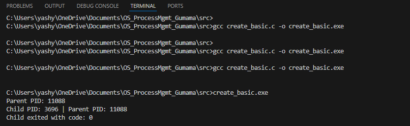
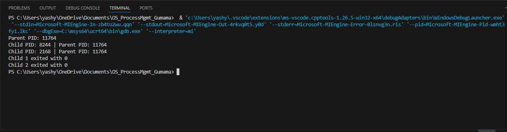
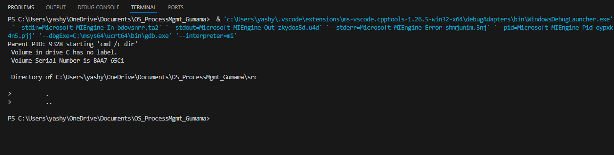
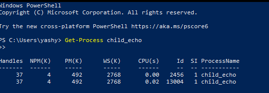

# OS_LA1_ProcessMgmt_Gumama

## Task A – Creating a Single Child
Output of `create_basic.exe` showing parent and child PIDs:

## Task B – Creating Two Children
Two child processes created in parallel:

## Task C – Simulating exec()
Parent creates a new process (`cmd /c dir`) and exits with the same code:

## Task D – Managing Processes in PowerShell
Child processes observed in PowerShell with `Get-Process` and terminated using `Stop-Process`:

